# Troika Clothing Web

The e-commerce website for Troika Clothing C.C., a Cut, Make and Trim clothing
manufacturer in Durban that wanted to move from wholesale into direct-to-consumer
retail. Customers browse the women's collection, save favourites, build a cart,
check out and receive an emailed receipt. Administrators maintain the catalogue,
manage user accounts and read a business intelligence dashboard built on the same
sales data. Written in C# with ASP.NET Web Forms on .NET Framework 4.7.2, over
SQL Server, and deployed to Azure App Service.

**Developed by:** Aisha Abba Omar, Denica Chetty, Peyton Govender, Firdous Mariam
Khan, Nontando Mthethwa, Antoinette Naidoo, Moosa Suliman Nakooda and Mohammed
Saib, across the 2025 and 2026 Information Systems & Technology modules.

The Troika system consists of three connected platforms: the e-commerce
website, the Troika mobile application, and the front-end system. All three
platforms connect to the same SQL Server database, allowing customer,
product, wishlist and order data to remain synchronised across the system. Data
created or updated through one platform is therefore available to the other
connected platforms, providing a consistent view of the catalogue, customers
and orders.
The website provides the main e-commerce and administrative functionality for retail orders. The 
[Troika Mobile](https://github.com/Mohammed-Saib/Troika-Mobile-App), is an Android
client that was built against the same SQL Server database, the same validation
rules and the same receipt design, so orders placed on either platform land in
the same tables and show up together in the reports.

## Screenshots

| Home | Home, dark mode | Shop |
| :---: | :---: | :---: |
| 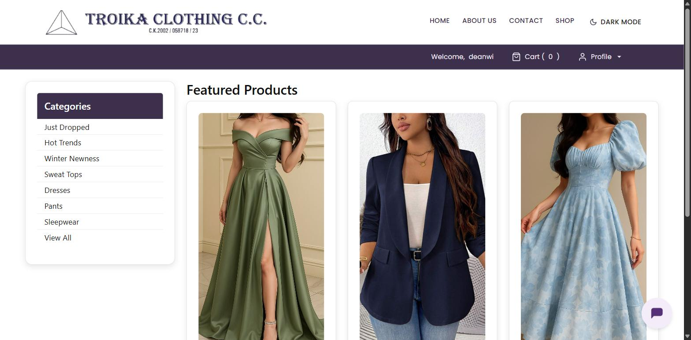 | 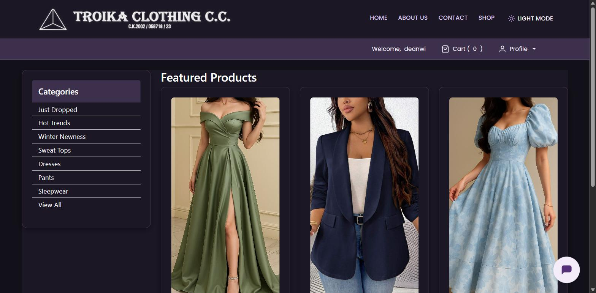 | 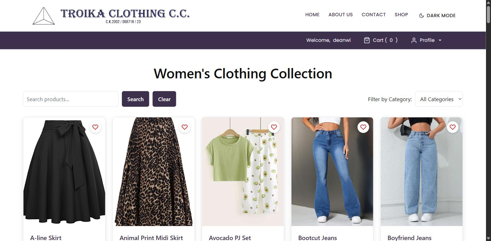 |

| Product detail | Size guide | Wishlist |
| :---: | :---: | :---: |
| 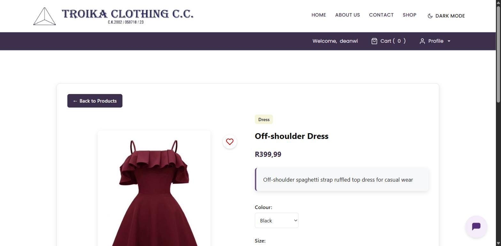 | 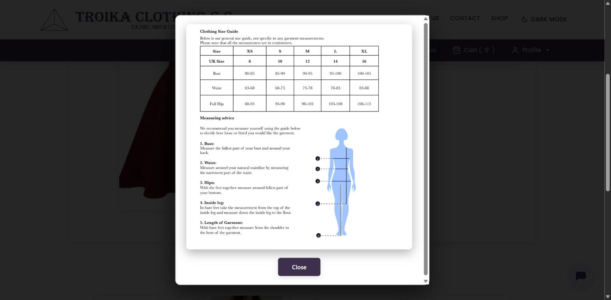 | 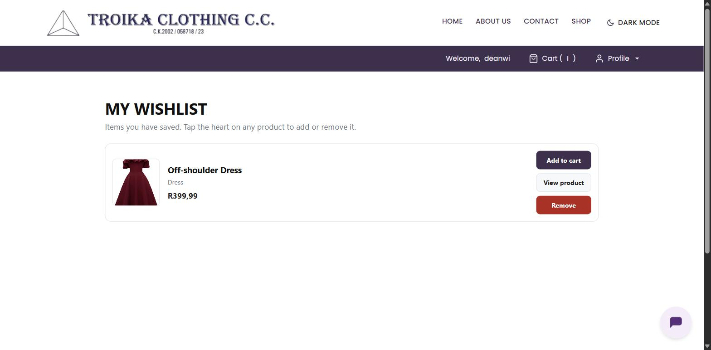 |

| Cart | Free delivery earned | Order confirmed |
| :---: | :---: | :---: |
|  | 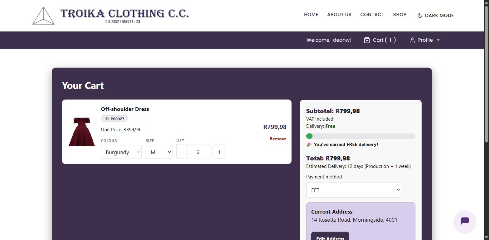 | 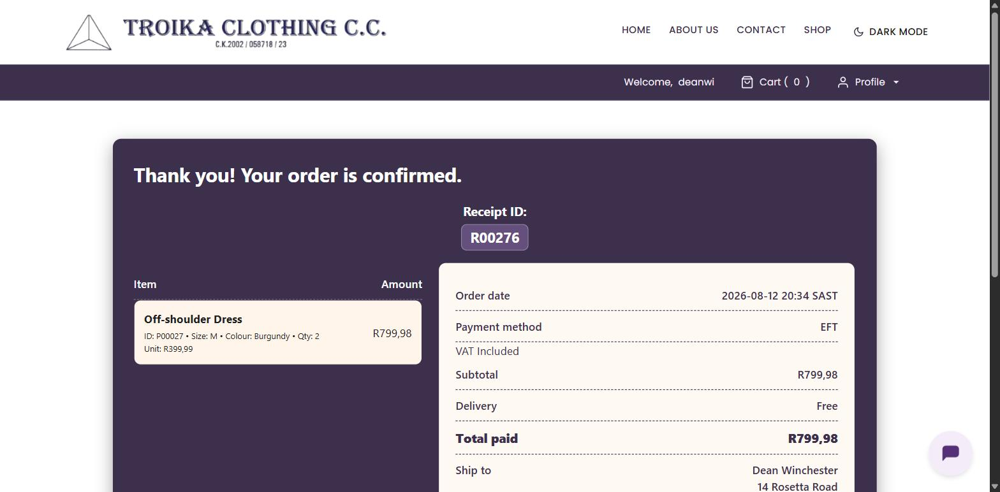 |

| Order history | Account | Register |
| :---: | :---: | :---: |
| 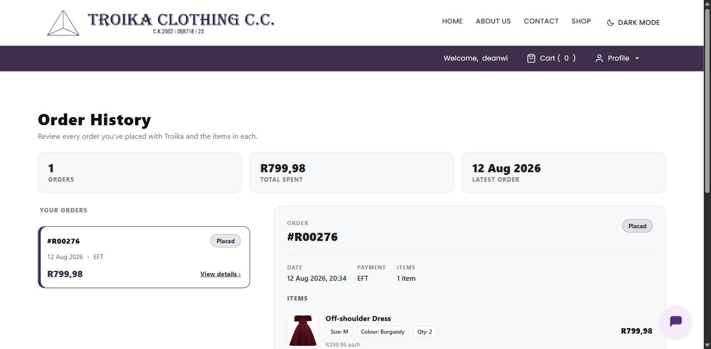 | 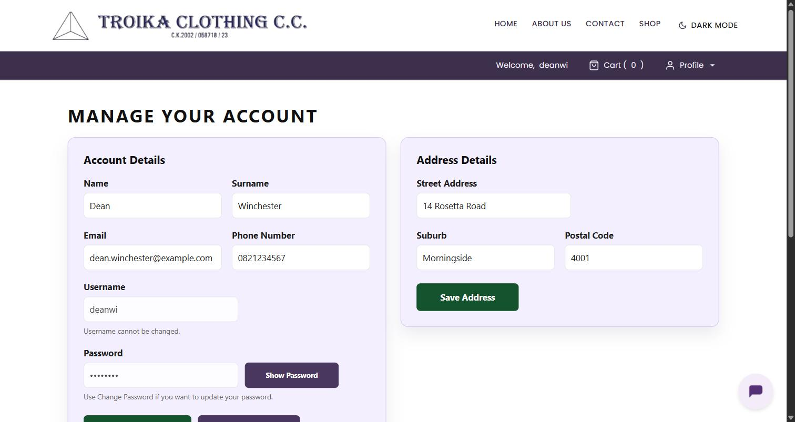 | 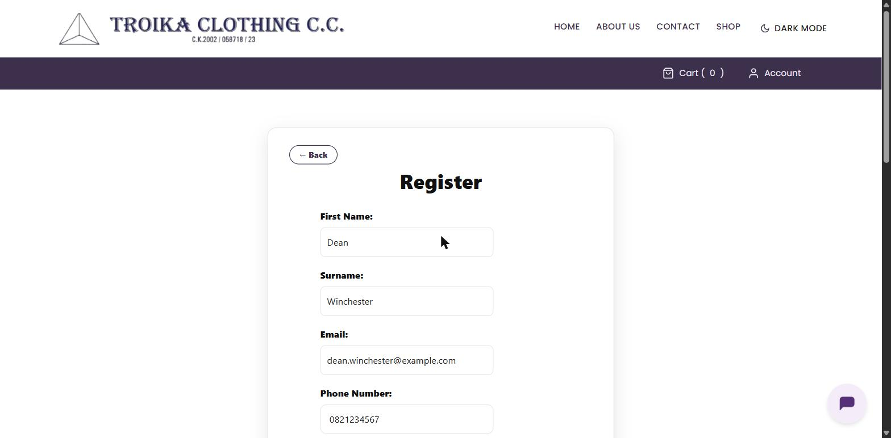 |

| Sign in | About | Contact |
| :---: | :---: | :---: |
| 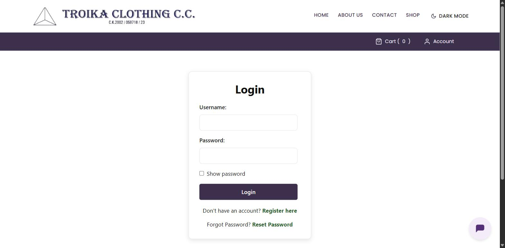 | 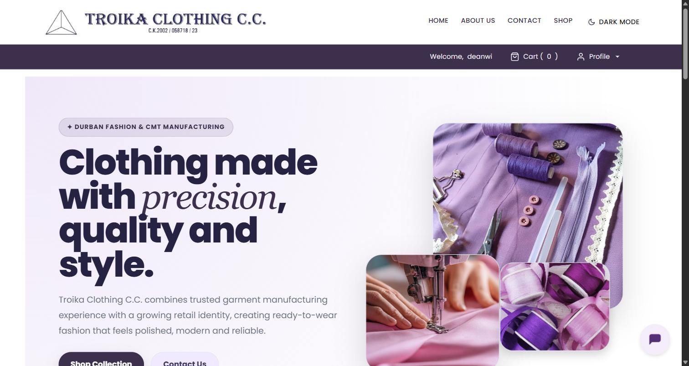 | 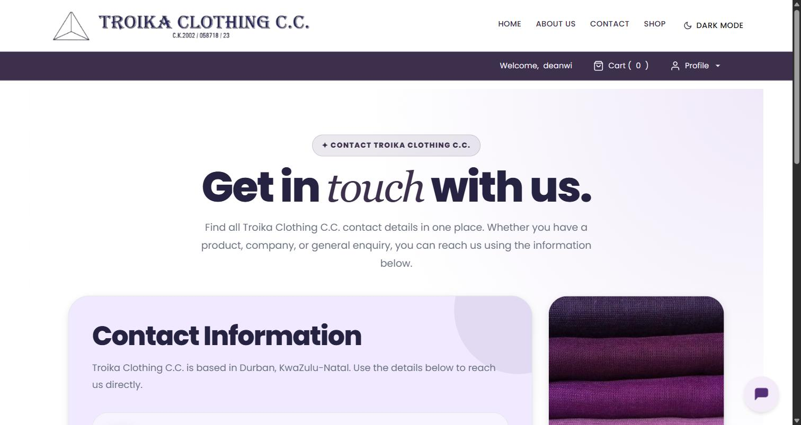 |

### Administrator

The reporting dashboard is the part worth looking at. Six KPIs, seven report
groups plus an overview that puts every headline chart on one screen, filters for
period, order status and sales channel, PDF and Excel export, and a mix of live
SQL charts and Python-computed analytics.

| User management | Product management |
| :---: | :---: |
| 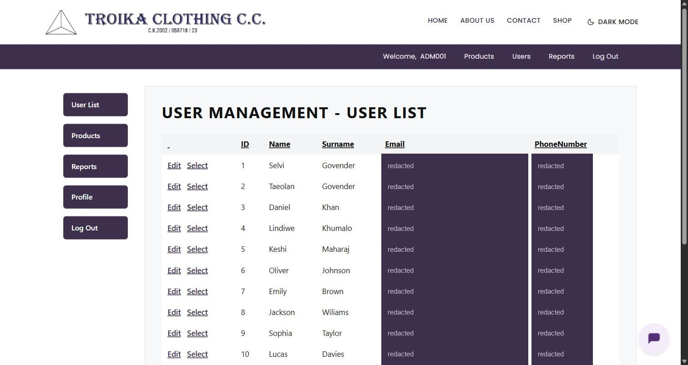 | 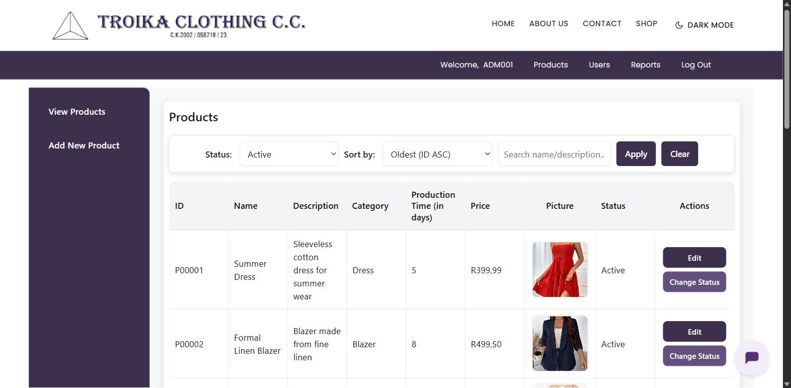 |

| KPIs, filters and export | Revenue trend, status funnel, categories, top products and regions |
| :---: | :---: |
| 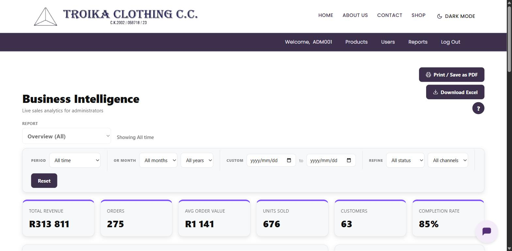 | 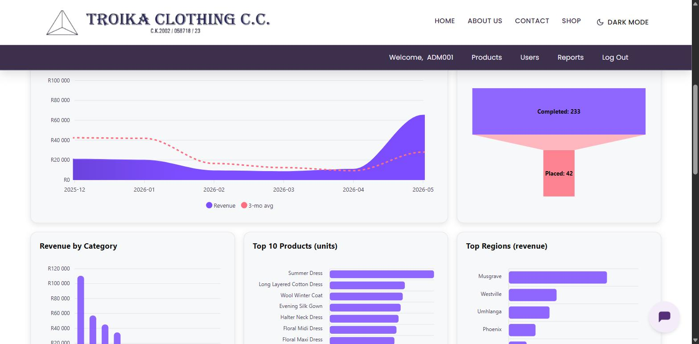 |

| RFM segmentation and repeat-purchase rate | Market-basket association rules |
| :---: | :---: |
| 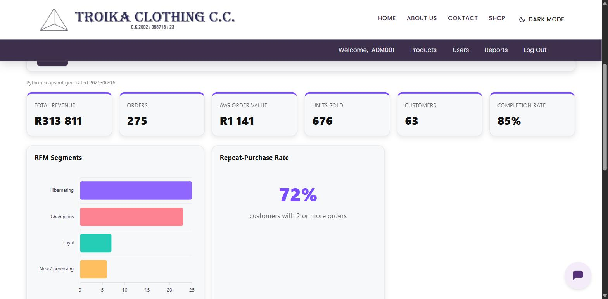 | 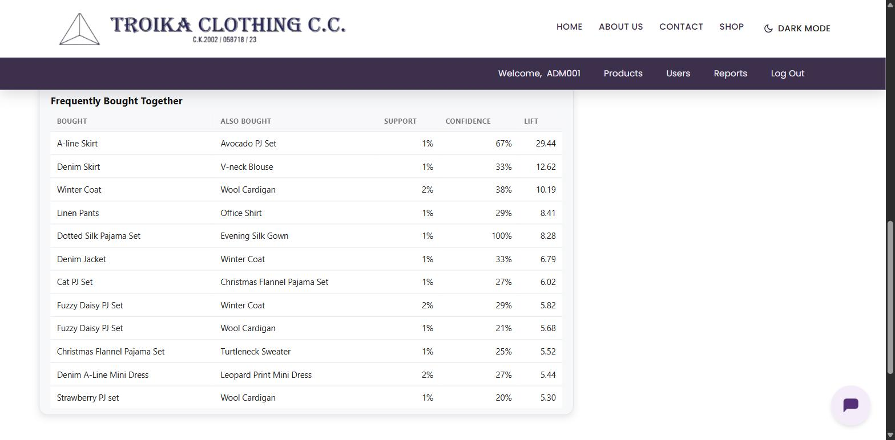 |

The RFM and basket panels are the Python side of the dashboard; the snapshot date
they were computed from is printed above the KPI row. Email addresses and phone
numbers in the user-management screenshot are redacted, since that page lists real
customer contact details.

## Features

### Accounts and access
Two roles, Customer and Administrator, both authenticated by `AuthService`
against the shared `WebsiteLogin` table rather than by ASP.NET Identity, so the
website and the mobile app sign in against exactly the same credentials. An
account must be `Active` before it is let in, which lets an administrator disable
a compromised account without deleting it and losing its order history.
Registration is screened by `RegistrationValidationService`: usernames are exactly
six characters, phone numbers exactly ten digits, and passwords are six to eight
characters carrying an uppercase letter, a lowercase letter, a digit and a symbol.
Forgotten passwords go through `PasswordResetService`.

Access control is not repeated page by page. Protected pages inherit `AdminPage`
or `CustomerPage`, which override `OnLoad` and redirect anyone without the right
session role, so every administrative page requires Administrator by construction
rather than by remembering to add a check.

### Browse and search
The catalogue lists active products only, searchable by name and description and
filterable by category. A product page carries its image, description, price,
colour and size selectors, a quantity stepper, a "you may also like" row of
related items, and a size guide dialog with the full measurement chart in
centimetres. Product images are stored as `VARBINARY(MAX)` in SQL Server and
streamed through `ProductImageHandler.ashx` with a half-hour public cache. Pages
that list products append an image version taken from the stored photo's byte
length to the handler's URL, so re-uploading a photo changes the URL and busts
that cache on its own.

### Wishlist
A heart on any product card or detail page saves the item, toggled through
`WishlistHandler.ashx` as JSON so the page never reloads. Saved items collect on a
My Wishlist page, newest first, where they can be viewed, added to the cart or
removed. A unique constraint on the `Wishlist` table stops the same product being
saved twice, and administrators are refused outright since the feature belongs to
shopping, not maintenance.

### Cart and checkout
The cart lives in session rather than the database, keyed by product, colour and
size, so the same dress in two sizes stays two lines. Quantities can never be
driven below one. `DeliveryRates` is the single source of truth for the money
rule, R80 delivery below R500 and free at or above it, and the cart, the progress
bar that tells you how much more you need for free delivery, and checkout all read
it, so the three can never disagree. Checkout refuses an empty cart and refuses to
proceed without a complete delivery address. The estimated delivery date is
derived from the longest production time in the order plus a week, because the
clothes are cut and made to order.

Placing an order writes the `Sale` record and all of its `ProductSold` lines
inside one `SqlTransaction`, so a failure anywhere rolls the whole thing back and
a half-written order never survives.

### Receipts
The confirmation screen shows the receipt number, the itemised order, the totals,
the delivery address and the estimated arrival. The same receipt is emailed
automatically, and can be resent or saved from the page. Money is formatted the
South African way throughout, R1 299,00 rather than R1,299.00, and order times are
stamped in South African Standard Time.

### Administration
Administrators get full create, read and update over the catalogue: name,
description, category, price, production time and image, with
`ProductValidationService` rejecting missing fields and non-numeric or non-positive
prices before anything reaches the database. Products are archived rather than
deleted, flipped from Active to Inactive, which takes them out of the shop while
keeping them intact in the orders that already reference them. Administrators can
also manage user accounts and read the reporting dashboard.

### Dark mode
`TroikaTheme.css` replaced colours that had been hardcoded across many ASPX pages
with a set of CSS variables covering backgrounds, text, cards, tables, buttons,
borders and form inputs. `theme-toggle.js` switches the theme state and remembers
the choice between visits, so a single stylesheet serves both looks and a future
palette change is one file rather than thirty.

### External integrations
Three services sit outside the application. Tokia, a Botpress chatbot, is embedded
site-wide for customer questions. The Gmail HTTP API sends the receipts; it is
used over HTTPS rather than SMTP because the campus network blocked the outbound
SMTP ports, and it authenticates with OAuth2 so no mailbox password is stored, a
refresh token being exchanged for a short-lived access token on each send. The
Google Maps Places API suggests delivery addresses as they are typed and fills in
the suburb and postal code, restricted to South Africa, with every field left
editable so the form still works when the service does not load.

## Tech stack

| Property | Value |
| --- | --- |
| Language | C# |
| Framework | ASP.NET Web Forms on .NET Framework 4.7.2 |
| IDE | Visual Studio 2022 |
| Database | Microsoft SQL Server |
| Data access | ADO.NET, `Microsoft.Data.SqlClient` 6.1.3, parameterised commands |
| Front end | Bootstrap 5.2.3, jQuery 3.7.0, hand-written CSS |
| Charts | ApexCharts, loaded on the reports dashboard |
| Offline analytics | Python with pandas and NumPy |
| Email | Gmail HTTP API over OAuth2 |
| Chatbot | Botpress |
| Address lookup | Google Maps Places API |
| JSON | Newtonsoft.Json 13.0.3 |
| Hosting | Azure App Service, published from Visual Studio with MSDeploy |

ASP.NET Identity and Entity Framework are still present because they came with
the Web Forms project template, but nothing in the Troika workflows uses them.
Registration, login, product management, checkout, the customer profile and the
reports all run on custom pages, services and repositories over ADO.NET. Treat
the `Account/` folder and the Owin and Identity packages as template scaffolding
rather than as part of the system.

Two configuration notes worth knowing before the project builds or runs. The
solution uses `packages.config` rather than PackageReference, so a plain
`msbuild /t:Restore` reports nothing to do; it needs
`msbuild /t:Restore /p:RestorePackagesConfig=true`, or a restore from within
Visual Studio. And `Web.config` holds the SQL Server connection string, the Gmail
OAuth credentials and the Google Maps key in plain `appSettings`, with
`Web.Release.config` transforming them for the Azure deployment.

## Architecture

A page never touches the database. Every request walks the same four steps: the
page hands a request model to a service, the service applies the business rules
and calls a repository interface, the repository runs parameterised ADO.NET
against SQL Server, and `Db.cs` is the only place a connection is opened.

```
TroikaClothingWeb/
├── Public Pages/          # Products, ProductDetail, Cart, OrderConfirmation, About, Contact
├── Customer Pages/        # HomePage, CustomerProfile, SaleHistory, Wishlist
├── Admin Pages/           # Admin, AdminProfile, ProductManagement, Reports
│   ├── ReportDataHandler.ashx    # Admin-only JSON feed for the dashboard
│   └── ProductImageHandler.ashx
├── Common/
│   ├── BasePage.cs        # Session helpers: current username, current role
│   ├── AdminPage.cs       # Requires the Administrator role
│   ├── CustomerPage.cs    # Requires the Customer role
│   ├── SaTime.cs          # South African time, independent of the host's zone
│   └── ServiceFactory.cs  # Wires services to their concrete repositories
├── Services/              # Business rules and validation, one class per feature
├── Repositories/          # SQL, behind IProductRepository, IOrderRepository, ...
├── Models/                # Requests, results and view models passed between layers
├── Data/Db.cs             # The single connection factory
├── Controls/              # AdminSidebar.ascx, PageMessage.ascx
├── Content/               # TroikaTheme.css and the per-page stylesheets
├── Scripts/               # theme-toggle, wishlist, delivery-tracker, address autocomplete
├── analysis/              # Python BI scripts, run offline
└── App_Data/reports/      # The JSON snapshots those scripts produce
```

| Layer | Responsibility | Examples |
| --- | --- | --- |
| Presentation | Renders pages and handles events | `.aspx` and their code-behind |
| Service | Business rules, validation, workflows | `CheckoutService`, `RegistrationService`, `ProductManagementService` |
| Repository | All SQL, behind an interface | `OrderRepository`, `ProductRepository`, `ReportRepository` |
| Model | Carries structured data between layers | `OrderReceipt`, `CartSummary`, `ProductSaveRequest` |

The interfaces are the part that earns its keep. `CheckoutService` takes an
`IOrderRepository` through its constructor, so the pricing and ordering rules can
be exercised without a database behind them, and the ADO.NET repositories could be
swapped for Entity Framework ones without touching a page.

This layout is the result of the 2026 refactor. The original 2025 code kept SQL,
validation, business rules and styling together in each page's code-behind, and
several pages used `SqlDataSource` controls with queries written into the markup.
The refactor moved those out in sixteen incremental passes, one feature at a time,
keeping the site working throughout rather than rewriting it.

## Data

One SQL Server database, shared with the mobile app so both platforms read and
write the same customers, catalogue and orders.

| Table | Contents |
| --- | --- |
| `WebsiteLogin` | Username, password, role and account status |
| `WebsiteRegister` | Sign-up details captured at registration |
| `Customer` | Contact details and delivery address |
| `RetailCustomer` | Name and surname for retail customers |
| `Product` | Catalogue: name, description, category, price, production time, image |
| `Wishlist` | Saved products, unique per customer and product |
| `Sale` | One row per order: receipt number, dates, totals, payment method, channel, status |
| `ProductSold` | The lines of an order: product, colour, size, quantity |

There is no cart table. The cart lives in session and only becomes durable data
at checkout, when it is written as one `Sale` and its `ProductSold` rows. Orders
carry a sale channel of `Website` or `Mobile`, which is what lets the reports
split the two platforms apart.

Receipt numbers and customer IDs are generated by reading the current maximum and
adding one, inside the same transaction as the insert.

`App_Data/reports/` holds JSON snapshots produced offline by the Python scripts in
`analysis/`. They are read by the dashboard as files, not regenerated on request.

## Business intelligence

The Reports page began as a small dashboard with a few totals on it. It was
rebuilt into the system's decision-support component, and it is the part of the
project that goes furthest beyond ordinary CRUD.

Six headline KPIs sit at the top: total revenue, total orders, average order
value, units sold, total customers and completion rate. Below them the reports are
grouped by the decision they support, and everything can be scoped by period,
order status and sales channel, then exported to PDF or Excel.

| Report group | What it answers |
| --- | --- |
| Sales | Revenue over time with a three-month moving average, average order value, the order-status funnel, payment-method and channel mix |
| Products | Revenue by category, top sellers, category mix over time, size and colour popularity |
| Customers | RFM segmentation, repeat-purchase rate, new versus returning, highest-value customers |
| Operations | Status trends, completion-rate trend, production lead time by category, free versus paid delivery |
| Seasonality | Revenue by calendar month, orders by weekday and by hour, three-month revenue forecast |
| Basket | Average basket size, items per order, products frequently bought together |
| Geography | Highest-earning suburbs, for regional marketing and delivery planning |

Two engines feed this. Most reports are live parameterised SQL through
`ReportRepository`, served to the browser as JSON by `ReportDataHandler.ashx` and
drawn with ApexCharts; the handler enforces the Administrator role itself rather
than trusting the page that called it, so the business data cannot be pulled by a
signed-in customer poking at the URL.

The heavier analysis is not SQL at all. The scripts in `analysis/` load the tables
with pandas and write JSON snapshots into `App_Data/reports/`, which the dashboard
then serves as static files. That is where the techniques that need real
computation live: RFM scoring of every customer on recency, frequency and monetary
value; market-basket association rules measured by support, confidence and lift;
and a revenue forecast that blends a linear trend with Holt-Winters exponential
smoothing to give a planning range rather than a single number. Running them is a
deliberate, offline step, so a report that takes seconds to compute never sits in
the request path.

## Security

Security is handled at four levels, and the theme running through all of them is
that the control lives in one shared place rather than being repeated, and
therefore forgotten, page by page.

**Authentication.** Credentials are checked against `WebsiteLogin` through a
parameterised query, the account status must be `Active`, and the username and
role go into the session.

**Authorisation.** Role checks live in `AdminPage` and `CustomerPage`, which
protected pages inherit, so the check cannot be left off a new page by accident.
The JSON handlers re-check the role themselves rather than assuming the page did.

**Data access.** Every query is a parameterised `SqlCommand` with named
parameters; no SQL is built by string concatenation anywhere in the repositories.
Connections and commands are wrapped in `using` blocks, and checkout is wrapped in
a transaction so an order is all-or-nothing.

**Input.** Validation runs server side in dedicated services,
`RegistrationValidationService`, `CustomerProfileValidationService` and
`ProductValidationService`, so disabling JavaScript in the browser bypasses
nothing. Password fields use `TextMode="Password"`, and the Gmail calls go over
TLS 1.2.

Three things are worth being upfront about rather than leaving for someone to
discover. **Passwords are stored in plain text.** That was fixed by the module's
shared schema, which the mobile app and the other team systems also authenticate
against, so hashing them here alone would have broken the rest. **`customErrors`
is still `Off`** in `Web.config`, and the Release transform leaves it alone, so a
deployed build shows stack traces to whoever triggers an error; it should be
`RemoteOnly`. **The `Web.config` in this repository carries a real connection
string and real API credentials**, because that is how the project was submitted.
Anyone reusing this code should move them into environment configuration and
rotate them. All three are listed under improvements below.

## Building

1. Clone the repository
2. Open `TroikaClothingWeb.sln` in Visual Studio 2022
3. Restore the NuGet packages. This is a `packages.config` project, so from the
   command line it needs
   `msbuild TroikaClothingWeb.sln /t:Restore /p:RestorePackagesConfig=true`
4. Point `LoginConnectionString` in `Web.config` at a SQL Server instance holding
   the schema above. `ReportsConnectionString` is the second name `Db.cs` knows
   about, used by the reporting queries
5. Build and run with F5, which starts IIS Express

The pages need a reachable database to render anything: the catalogue, accounts
and orders all come from SQL Server, and there is no seed data or local fallback.
The Gmail keys in `appSettings` are only needed for the receipt emails, and the
Google Maps key only for address autocomplete; without either, the rest of the
site still works and the address fields stay typeable.

### Demo account

```
Username: deanwi
Password: Dean@123
```

Registering works too. The rules are exactly six characters for a username, ten
digits for a phone number, and six to eight characters for a password with an
uppercase letter, a lowercase letter, a number and a special character.

Administrator accounts are not self-service. An existing administrator creates
them, or the role is set directly on the `WebsiteLogin` row.

## Possible improvements

**Security**
- Hash passwords with a modern KDF instead of storing them in plain text, across
  the website, the API and the mobile app together, since they share a schema
- Set `customErrors` to `RemoteOnly` so a deployed error page stops leaking stack
  traces
- Move the connection string, the Gmail OAuth credentials and the Maps key out of
  a committed `Web.config`, and rotate the ones already in this history
- Real session tokens with expiry and rotation, rather than a username and role
  parked in session state

**Testing**
- Turn the manual test cases into an automated suite. `CheckoutService` already
  takes its repository through the constructor, so the pricing rules, the R500
  threshold and the address requirement can be unit tested as they stand
- Integration tests for the checkout transaction, covering the rollback path as
  well as the happy one
- A CI workflow that builds and runs the tests on every push

**Features**
- A real payment gateway, in place of the simulated confirmation
- Customer ratings and reviews on the product page
- Discounts, promotional codes and a mailing list, all of which were ruled out of
  the original scope
- Order tracking as a timeline rather than a single status word
- Colours and sizes as per-product data with stock levels, instead of a fixed list
  in the UI

**Code and data**
- Pagination on the catalogue, which is fine at the current size and would not be
  at ten times it
- Move the remaining page-level `DateTime` formatting behind a shared helper, so
  every displayed timestamp goes through `SaTime` the way the receipt does
- Retire the unused ASP.NET Identity, Entity Framework and Owin scaffolding left
  over from the project template
- Schedule the Python analysis rather than running it by hand, so the snapshot
  reports do not go stale

## The mobile app

**https://github.com/Mohammed-Saib/Troika-Mobile-App**

Troika Mobile is the Android half of the same system, written in Kotlin with
Jetpack Compose. It was built against this website's SQL Server database through
an ASP.NET Core minimal API, reusing the schema, the validation rules, the pricing
and the receipt design rather than reimplementing them, so an order placed on a
phone lands in the same `Sale` and `ProductSold` tables as one placed here. Mobile
orders are tagged with a `Mobile` sale channel, which is what lets the reports in
this project separate the two platforms.

## Contributors

The website was built across two academic years by two teams that shared some
members. The 2025 team built the system; the 2026 team fixed, refactored,
extended and documented it.

### 2025

**Aisha Abba Omar** worked as project manager, developer, designer and deployment
lead. She coordinated sprint planning and progress checking, developed the site master, home, customer profile and order history pages. She also ensured logical navigation throughout the system and
was responsible for the safe deployment of the website.

**Denica Chetty** worked as a developer and on the documentation. She built the
first iterations of the customer profile page, establishing the shape that the
account screens would later grow into.

**Peyton Govender** worked as a developer and designer, and on the documentation.
She took the early prototypes through to working screens and built the user
management and admin profile pages that the administrator side is organised
around.

**Firdous Mariam Khan** worked as a developer and tester, and on the
documentation. She built the products page and the add-to-cart page, and together
with Mohammed Saib she built the checkout functionality, seeing the ordering flow
through from a browsing customer to a completed order. She also tested the system
for logic errors.

**Antoinette Naidoo** worked as a developer, client liaison and designer, and on
the documentation. She interviewed Troika's stakeholders and spent time observing
how the business actually ran, then carried what she learned back to the team,
which is how much of the system's behaviour came to be defined. Alongside the
prototyping she designed the reporting structure.

**Mohammed Abdullah Saib** worked as a developer and tester, and on the documentation. He
built the product management, add product and update product pages that give the
administrator control of the catalogue, and together with Firdous Mariam
Khan he built the checkout functionality. He also integrated the Tokia chatbot and
the email service that sends order receipts, and tested the system for logic
errors.

### 2026

**Aisha Abba Omar** worked as project manager and on the documentation. She managed sprint planning and the delegation of responsibilities across the team. She documented the methodology, team
structure and version-control processes, and contributed to the business
intelligence, KMT, feasibility and usability documentation. She was responsible for ensuring the safe deployment of the website.

**Firdous Mariam Khan** worked as a developer and tester, and on the documentation. She led the refactor of the codebase into the layered architecture, moving the SQL, validation and business rules out of the pages and into
repositories and services, which is what makes the system maintainable today. As part of her testing responsibilities, she tested both the website and mobile application for functional and logic errors, checking that features
worked as expected and that changes made during the refactoring did not introduce new problems.
Alongside that she fixed defects carried over from 2025, implemented the Dark Mode feature, improved the overall user interface, and worked on the mobile application.

**Nontando Mthethwa** worked on the documentation of the system's features and functionality,
contributed to the Human Computer Interaction(HCI) documentation and conducted surveys with users to gather
feedback and information about the usability and user experience of the system.

**Mohammed Saib** worked as a developer and tester, and on the documentation. His
main piece of work was the business intelligence and reporting module, which he
redesigned from a page of basic totals into a proper decision-support dashboard:
six headline KPIs, seven report groups and an overview that puts every headline
chart on one screen, filters for period, order status and sales channel, and
export to PDF and Excel, all fed by an admin-only JSON endpoint that enforces the
administrator role itself rather than trusting the page that called it. Behind
that dashboard he built a Python analysis layer for the work that genuinely needs
computing, scoring every customer by recency, frequency and monetary value,
deriving market-basket association rules from what sells together, and producing a
revenue forecast. He also built the wishlist end to end, from the JSON toggle
handler through to the My Wishlist page, and integrated the Google Maps Places API
so that delivery addresses are suggested as a customer types and the suburb and
postal code fill themselves in. Beyond those features he improved the
administrator functions, fixed defects carried over from 2025, tested, and built the
mobile application.

**Moosa Suliman Nakooda** worked on the documentation. He documented the
Knowledge Management Theory (KMT) and security components and conducted surveys
with users to gather information relevant to the evaluation and development of
the system.
